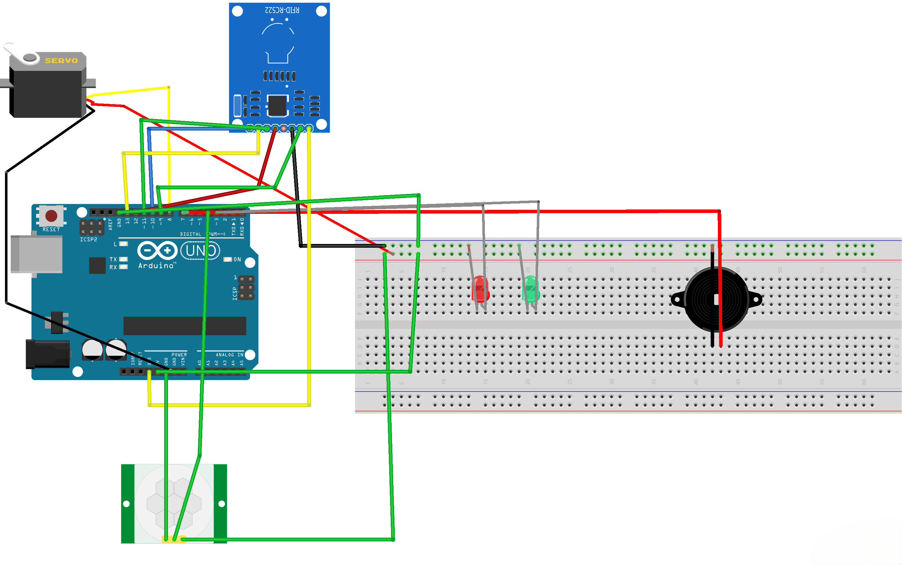

## RFID-Door-Lock-with-Arduino-Uno

## Description:
RFID card adalah kartu yang pada permukannya ditanam label atau tag RFID. Fungsi tag RFID tersebut adalah untuk menyimpan suatu data. Untuk memasukkan data pada kartu tersebut diperlukan mesin RFID reader yang dapat dihubungkan pada komputer.

## Component (Tools & Materials):

5 mm LED:Green = 1 unit; • Arduino UNO = 1 unit; • 5 mm LED: Red = 1 unit; • Breadboard (generic) = 1 unit; • Buzzer = 1 unit; • PIR Sensor = 1 unit; • MFRC522 RFID/NFC Reader = 1 unit; • SG90 Micro Servo = 1 unit; • Jumper wires (generic) = 1 unit; • 9V Power Supply = 1 unit.

## Circuit Schematic:



## Sketch Code Program:

```cpp
/// This project was made by Andika Pratama AP.
#include <RFID.h>
#include <SPI.h>
#include <Servo.h>

#define SS_PIN 10
#define RST_PIN 9
#define SERVO_PIN 8
#define red 2
#define green 3
#define buzzer 7
#define pir 4

int data;

Servo servo;
RFID rfid(SS_PIN, RST_PIN);

boolean card = false;
int rfid_id[5] = {227, 88, 145, 52, 30};
boolean lock = false;

void lock_door() { /// Closes the door.
  if (lock) {
    servo.write(180);
    Serial.println("Door closed.");
    delay(100);
    servo.write(0);
  }
}

void setup() {
  pinMode(red, OUTPUT);
  pinMode(green, OUTPUT);
  pinMode(buzzer, OUTPUT);
  pinMode(pir, INPUT);
  servo.attach(SERVO_PIN);
  Serial.begin(9600);
  SPI.begin();
  rfid.init();
}

void loop() {
  card = true;
  data = digitalRead(pir);
  Serial.print("Veri: ");
  Serial.println(data);
  servo.write(180);
  if (rfid.isCard()) {
    if (rfid.readCardSerial()) {
      Serial.print("ID: ");
      delay(100);
    }
    for (int i = 0; i < 5; i++) {
      Serial.print(rfid.serNum[i]);
      Serial.print(" ");
      delay(100);
    }
    boolean trueid = true;
    for (int i = 0; i < 5; i++) {
      if (rfid_id[i] != rfid.serNum[i]) {
        trueid = false;
        break;
      }
    }
    if (trueid) {
      Serial.println();
      delay(1000);
      Serial.println("Welcome to your room");
      delay(1000);
      digitalWrite(green, HIGH);
      delay(200);
      digitalWrite(red, LOW);
      tone(buzzer, 3);
      delay(1000);
      noTone(buzzer);
      delay(100);
      servo.write(0);
      delay(2000);
      Serial.println("Door opened.");
      delay(1000);
      digitalWrite(green, LOW);
      delay(10000);
      lock_door();
      delay(2000);
      servo.write(180);
      Serial.println("Door closed.");
      while (true) { // Loop to check PIR sensor continuously
        data = digitalRead(pir);
        if (data == 1) {
          Serial.println("Motion detected, opening door.");
          servo.write(0);
          delay(2000); // Door stays open for 2 seconds
          Serial.println("Door opened.");
          tone(buzzer, 3);
          delay(1000);
          noTone(buzzer);
          delay(10000); // Wait for 10 seconds
          servo.write(180);
          Serial.println("Door closed.");
          tone(buzzer, 3);
          delay(2000); // Allow time for door to close
          noTone(buzzer);
        }
        delay(500); // Check every 0.5 seconds
      }
    } else {
      digitalWrite(red, HIGH);
      tone(buzzer, 3);
      delay(1000);
      noTone(buzzer);
      Serial.println("Wrong ID.");
      delay(2000);
      digitalWrite(red, LOW);
    }
  }
}
